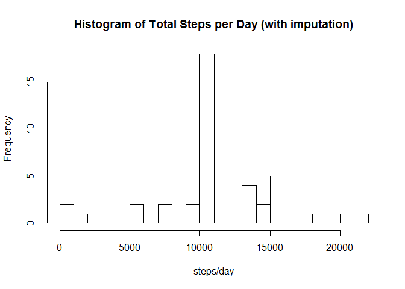

# Reproducible Research: Peer Assessment 1
by_mcmillan03  

"This assignment makes use of data from a personal activity monitoring device. This device collects data at 5 minute intervals through out the day. The data consists of two months of data from an anonymous individual collected during the months of October and November, 2012 and include the number of steps taken in 5 minute intervals each day."


## Loading and preprocessing the data

Set working directory to parent directory of data. Raw data in activity.csv should appear in an activity subdirectory.


```r
# Read the data set and convert the date field to Date objects
raw_activity = read.csv("activity/activity.csv", header=TRUE)
raw_activity$date = as.Date(raw_activity$date)
str(raw_activity)
```

```
## 'data.frame':	17568 obs. of  3 variables:
##  $ steps   : int  NA NA NA NA NA NA NA NA NA NA ...
##  $ date    : Date, format: "2012-10-01" "2012-10-01" ...
##  $ interval: int  0 5 10 15 20 25 30 35 40 45 ...
```

```r
summary(raw_activity)
```

```
##      steps             date               interval     
##  Min.   :  0.00   Min.   :2012-10-01   Min.   :   0.0  
##  1st Qu.:  0.00   1st Qu.:2012-10-16   1st Qu.: 588.8  
##  Median :  0.00   Median :2012-10-31   Median :1177.5  
##  Mean   : 37.38   Mean   :2012-10-31   Mean   :1177.5  
##  3rd Qu.: 12.00   3rd Qu.:2012-11-15   3rd Qu.:1766.2  
##  Max.   :806.00   Max.   :2012-11-30   Max.   :2355.0  
##  NA's   :2304
```

Because of the example output given later, I have made a conscious decision to NOT convert the interval data, which are integers in the form of HHMM (that, e.g., jump from 1155 to 1200), to occur in more uniform intervals.

## What is mean total number of steps taken per day?

This is a histogram of the total number of steps taken each day.


```r
library(plyr)

# remove any rows with NA's
activity <- raw_activity[complete.cases(raw_activity),]

# sum the steps within each date
daily_activity <- ddply(activity,
                        .(date),
                        summarize,
                        steps=sum(steps))
summary(daily_activity)
```

```
##       date                steps      
##  Min.   :2012-10-02   Min.   :   41  
##  1st Qu.:2012-10-16   1st Qu.: 8841  
##  Median :2012-10-29   Median :10765  
##  Mean   :2012-10-30   Mean   :10766  
##  3rd Qu.:2012-11-16   3rd Qu.:13294  
##  Max.   :2012-11-29   Max.   :21194
```

```r
hist(daily_activity$steps,
     breaks=24,
     main="Histogram of Total Steps per Day",
     xlab="steps/day")
```

 

This computes the average after all NA's have been removed.  Some resulting partial days may not be accurate as a result.


```r
mean_steps_per_day = mean(daily_activity$steps)
median_steps_per_day = median(daily_activity$steps)
```
steps/day, mean   = 1.0766189\times 10^{4}.  
steps/day, median = 10765.

## What is the average daily activity pattern?

For this computation we average all samples for a given 5 minute interval to compute a daily activity pattern that is plotted in the line graph below.


```r
mean_interval_activity <- ddply(activity,
                                .(interval),
                                summarize,
                                avg_steps=mean(steps))
summary(mean_interval_activity)
```

```
##     interval        avg_steps      
##  Min.   :   0.0   Min.   :  0.000  
##  1st Qu.: 588.8   1st Qu.:  2.486  
##  Median :1177.5   Median : 34.113  
##  Mean   :1177.5   Mean   : 37.383  
##  3rd Qu.:1766.2   3rd Qu.: 52.835  
##  Max.   :2355.0   Max.   :206.170
```

```r
plot(mean_interval_activity$interval,  
     mean_interval_activity$avg_steps,  
     type="l",  
     xlab="Interval (HHMM)", ylab="Number of steps (avg.)",  
     main="Average Steps per 5-Minute Interval")
```

 

Interval with maximum average steps:


```r
idx = which.max(mean_interval_activity$avg_steps)
mean_interval_activity[idx,]
```

The interval with the highest average steps is 835 which has an average of 206.1698113 steps.

## Imputing missing values


```r
num_NA_rows = sum(!complete.cases(raw_activity))
```
The number of records with NA: 2304

Imputation method: for each interval with missing steps data, insert the average number of steps over all other samples with the same interval.

```r
# impute missing values by inserting the average for the same interval
imputed_activity <- raw_activity
for (i in 1:nrow(raw_activity)) {
  if (is.na(raw_activity$steps[i])) {
    imputed_value_index <- which(mean_interval_activity$interval == raw_activity$interval[i])
    imputed_activity$steps[i] <- mean_interval_activity$avg_steps[imputed_value_index]
  }  
}

# Summary stats for the imputed set should be the same as raw.
summary(imputed_activity)
```

```
##      steps             date               interval     
##  Min.   :  0.00   Min.   :2012-10-01   Min.   :   0.0  
##  1st Qu.:  0.00   1st Qu.:2012-10-16   1st Qu.: 588.8  
##  Median :  0.00   Median :2012-10-31   Median :1177.5  
##  Mean   : 37.38   Mean   :2012-10-31   Mean   :1177.5  
##  3rd Qu.: 27.00   3rd Qu.:2012-11-15   3rd Qu.:1766.2  
##  Max.   :806.00   Max.   :2012-11-30   Max.   :2355.0
```

```r
daily_imputed_activity <- ddply(imputed_activity, .(date), summarize, steps=sum(steps))
summary(daily_imputed_activity)
```

```
##       date                steps      
##  Min.   :2012-10-01   Min.   :   41  
##  1st Qu.:2012-10-16   1st Qu.: 9819  
##  Median :2012-10-31   Median :10766  
##  Mean   :2012-10-31   Mean   :10766  
##  3rd Qu.:2012-11-15   3rd Qu.:12811  
##  Max.   :2012-11-30   Max.   :21194
```

```r
hist(daily_imputed_activity$steps,
     breaks=24,
     main="Histogram of Total Steps per Day (with imputation)",
     xlab="steps/day")
```

 

```r
mean_imputed_steps_per_day = mean(daily_imputed_activity$steps)
median_imputed_steps_per_day = median(daily_imputed_activity$steps)
```
imputed steps/day, mean   = 1.0766189\times 10^{4}.  
imputed steps/day, median = 1.0766189\times 10^{4}.

No significant difference for original mean.  Median in insignificantly different due to use of floating point averages for imputation.

The only difference is there are more instances of days in the range 10000 - 11000 steps/day (the interval containing the mean). This is consistent with the fact that NA's occured for all intervals of each day for which they were present.
Because of this, there is little impact of imputing missing data on the mean and median estimates of the total daily number of steps.

## Are there differences in activity patterns between weekdays and weekends?


```r
day_type = factor(!(weekdays(imputed_activity$date) %in% c("Saturday","Sunday")))
levels(day_type) <- c("weekend","weekday")
imputed_activity$day_type = day_type

mean_imputed_interval_activity <- ddply(imputed_activity,
                                        .(interval, day_type),
                                        summarize,
                                        steps=mean(steps))
str(mean_imputed_interval_activity)
```

```
## 'data.frame':	576 obs. of  3 variables:
##  $ interval: int  0 0 5 5 10 10 15 15 20 20 ...
##  $ day_type: Factor w/ 2 levels "weekend","weekday": 1 2 1 2 1 2 1 2 1 2 ...
##  $ steps   : num  0.2146 2.2512 0.0425 0.4453 0.0165 ...
```

```r
library(ggplot2)
ggplot(mean_imputed_interval_activity, aes(interval,steps)) +
    geom_line(color="blue") +
    xlab("Interval") + ylab("Number of steps") +
    facet_wrap(~day_type, ncol=1)
```

 

From these plots it seems that on weekdays the person wakes around 5:30 am with a flurry of activity between 8 and 9 am (going to the gym?).  On weekends wake times are less well defined with a similar peak in activity around 8 to 9 am (though not as high).  The person seems more active throughout the day on weekends than on weekdays.
